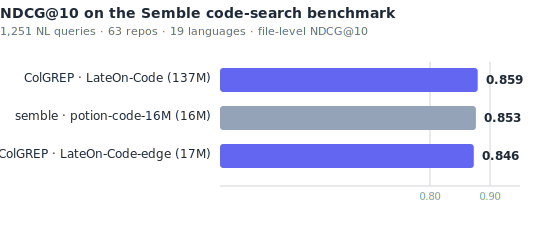
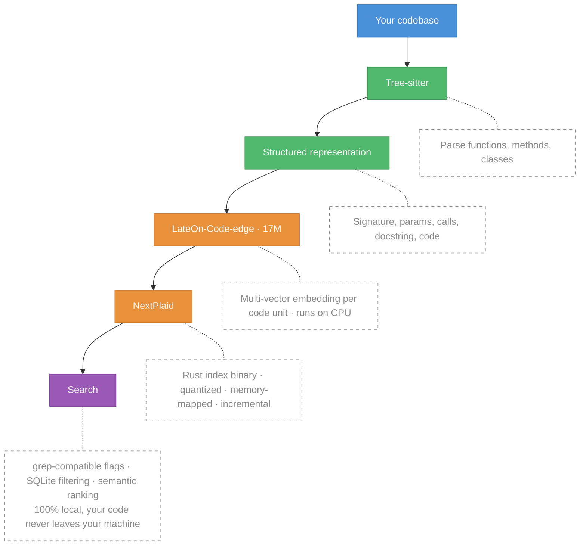

<div align="center">
  <h1>ColGREP</h1>
  <p>Semantic code search for your terminal and your coding agents, built on NextPlaid.<br/>
  Combines regex filtering with semantic ranking with LateOn-Code-edge multi-vector embeddings.<br/>
  A single Rust binary. No server. No API. 100% local, your code never leaves your machine.</p>

  

  <p>
    <a href="#quick-start"><b>Quick Start</b></a>
    &middot;
    <a href="#search-modes"><b>Search Modes</b></a>
    &middot;
    <a href="#benchmarks"><b>Benchmarks</b></a>
    &middot;
    <a href="#agent-integrations"><b>Agent Integrations</b></a>
    &middot;
    <a href="#how-it-works"><b>How It Works</b></a>
    &middot;
    <a href="#installation"><b>Installation</b></a>
  </p>
</div>

## Benchmarks

[Semble](https://github.com/MinishLab/semble)'s public bench — 1,251 NL queries × 63 repos × 19 languages — scored at NDCG@10 against file-level annotations. ColGREP runs on a single H100 GPU at FP32; `colgrep set-model lightonai/LateOn-Code` switches to the 137M big model.

Reproduce:

```bash
git clone https://github.com/MinishLab/semble && cd semble
colgrep set-model lightonai/LateOn-Code-edge   # or lightonai/LateOn-Code
CUDA_VISIBLE_DEVICES=0 uv run python -m benchmarks.baselines.colgrep
```

<p align="center">
  <picture>
    <source media="(prefers-color-scheme: dark)" srcset="../docs/colgrep-bench-dark.svg">
    
  </picture>
</p>

## Quick Start

**Install:**

Homebrew (macOS / Linux)
```bash
brew install lightonai/tap/colgrep
```

Shell installer (macOS / Linux)
```bash
curl --proto '=https' --tlsv1.2 -LsSf https://github.com/lightonai/next-plaid/releases/latest/download/colgrep-installer.sh | sh
```

Windows (PowerShell)
```bash
powershell -c "irm https://github.com/lightonai/next-plaid/releases/latest/download/colgrep-installer.ps1 | iex"
```

> **macOS** binaries ship with **Apple Accelerate + CoreML** enabled — full hardware acceleration out of the box.
>
> **Linux & Windows** binaries work immediately but run on CPU only. For hardware acceleration, install via Cargo — see [Installation](#installation).

**Build the index:**

```bash
colgrep init              # current directory
colgrep init /path/to/project  # or a specific project
colgrep init -y  # auto-confirm for large codebases (>10K code units)
```

**Search:**

```bash
colgrep "database connection pooling"
```

No setup, no config, no dependencies. `colgrep init` builds the index for the first time. After that, every search detects file changes and updates the index automatically before returning results. Supports `--model` to override the ColBERT model and `--pool-factor` to control embedding compression.

---

## Search Modes

ColGREP supports four search modes: **semantic**, **keyword**, **hybrid** (semantic + keyword), and **regex**.

### Semantic + Keyword Hybrid (default)

By default, every query runs both ColBERT semantic search and FTS5 trigram keyword search, fused with Reciprocal Rank Fusion (RRF). This finds code by meaning *and* by exact identifier/substring matches:

```bash
colgrep "database connection pooling"
colgrep "parse_arguments"              # trigram matches substrings
colgrep "authentication middleware" ./src
```

The trigram tokenizer enables substring matching: searching `"parse"` finds `"parse_arguments"`, `"JSON.parse"`, etc. The FTS5 index covers all code unit metadata: names, signatures, file paths, source code, docstrings, parameters, imports, and call graph.

### Regex Search

Use `-e` for traditional pattern matching (ERE syntax by default):

```bash
colgrep -e "async fn\s+\w+"
colgrep -e "TODO|FIXME|HACK"
colgrep -e "impl\s+Display" --include="*.rs"
```

### Regex + Semantic Hybrid

Combine regex filtering with semantic ranking. Regex narrows the candidates, semantics ranks them:

```bash
# Find async functions, rank by "error handling"
colgrep -e "async fn" "error handling"

# Find Result types, rank by "database operations"
colgrep -e "Result<" "database operations" --include="*.rs"

# Find TODOs, rank by relevance to "security"
colgrep -e "TODO" "security concerns"
```

### Pure Semantic Search

Disable keyword fusion with `--semantic-only` for a single query, or persistently via settings:

```bash
# One-shot
colgrep --semantic-only "error handling"

# Persistent
colgrep settings --no-hybrid-search
```

---

## CLI Reference

### Search Options

| Flag | Long                | Description                              |
| ---- | ------------------- | ---------------------------------------- |
| `-e` | `--pattern`         | Regex pre-filter (ERE syntax)            |
| `-E` | `--extended-regexp` | ERE mode (default, kept for grep compat) |
| `-F` | `--fixed-strings`   | Treat `-e` as literal string             |
| `-w` | `--word-regexp`     | Whole-word match for `-e`                |
| `-k` | `--results`         | Number of results (default: 15)          |
| `-n` | `--lines`           | Context lines to show (default: 6)       |
| `-l` | `--files-only`      | List matching files only                 |
| `-c` | `--content`         | Show full function/class content         |
| `-r` | `--recursive`       | Recursive (default, for grep compat)     |
| `-y` | `--yes`             | Auto-confirm indexing                    |
|      | `--json`            | JSON output                              |
|      | `--code-only`       | Skip docs/config files                   |
|      | `--semantic-only`   | Disable hybrid search (pure semantic)    |
|      | `--include`         | Filter by glob (e.g., `"*.rs"`)          |
|      | `--exclude`         | Exclude files by glob                    |
|      | `--exclude-dir`     | Exclude directories                      |
|      | `--model`           | Override ColBERT model                   |
|      | `--no-pool`         | Disable embedding pooling                |
|      | `--pool-factor`     | Set pool factor (default: 2)             |

### Filtering

```bash
# By file extension
colgrep --include="*.py" "database query"
colgrep --include="*.{ts,tsx}" "React component"

# By path pattern
colgrep --include="src/**/*.rs" "config parsing"
colgrep --include="**/tests/**" "test helper"

# Exclude files or directories
colgrep --exclude="*.test.ts" "component"
colgrep --exclude-dir="vendor" --exclude-dir="node_modules" "import"

# Search specific paths
colgrep "error handling" ./src/api ./src/auth

# Code-only (skip markdown, yaml, json, etc.)
colgrep --code-only "authentication logic"
```

**Glob pattern syntax:**

| Pattern       | Matches                         |
| ------------- | ------------------------------- |
| `*.py`        | All Python files                |
| `*.{ts,tsx}`  | TypeScript and TSX files        |
| `src/**/*.rs` | Rust files under `src/`         |
| `**/tests/**` | Files in any `tests/` directory |
| `*_test.go`   | Go test files                   |

### Output Modes

```bash
# Default: filepath:lines with context
colgrep "authentication"

# Files only (like grep -l)
colgrep -l "database queries"

# Full content with syntax highlighting
colgrep -c "authentication handler" -k 5

# JSON for scripting
colgrep --json "auth" | jq '.[] | .unit.file'
```

### Subcommands

| Command                  | Description                            |
| ------------------------ | -------------------------------------- |
| `colgrep init`           | Build or update the index              |
| `colgrep status`         | Show index status for current project  |
| `colgrep clear`          | Clear index for current project        |
| `colgrep clear --all`    | Clear all indexes                      |
| `colgrep set-model <ID>` | Change the default ColBERT model       |
| `colgrep settings`       | View or modify configuration           |
| `colgrep settings --ignore` | Add extra ignore patterns (persistent) |
| `colgrep settings --force-include` | Force-include normally ignored paths |
| `colgrep --stats`        | Show search statistics for all indexes |

---

## Configuration

```bash
# Show current config
colgrep settings

# Set default results count
colgrep settings --k 20

# Set default context lines
colgrep settings --n 10

# Use INT8 quantized model (faster inference)
colgrep settings --int8

# Use FP32 full precision (more accurate)
colgrep settings --fp32

# Set embedding pool factor (2 = 50% smaller index, 1 = full precision)
colgrep settings --pool-factor 2

# Set parallel encoding sessions (default: CPU count, max 16)
colgrep settings --parallel 8

# Set batch size per session (default: 1 for CPU, 64 for CUDA)
colgrep settings --batch-size 2

# Set parser recursion depth guard (default: 1024)
colgrep settings --max-recursion-depth 1024

# Enable verbose output by default
colgrep settings --verbose

# Reset a value to default (pass 0)
colgrep settings --k 0 --n 0
```

### Hybrid Search

By default, colgrep fuses ColBERT semantic search with FTS5 trigram keyword search using Reciprocal Rank Fusion (RRF). This improves recall for exact identifier matches with negligible indexing overhead. You can disable it persistently:

```bash
# Disable hybrid search (pure semantic mode)
colgrep settings --no-hybrid-search

# Re-enable hybrid search (default)
colgrep settings --hybrid-search
```

The `--semantic-only` CLI flag works as a one-shot override without changing the setting.

### Relative Paths

By default, colgrep displays absolute file paths in search output. You can switch to relative paths (relative to the current working directory) to improve readability and save ~35% tokens when used with LLMs:

```bash
# Enable relative paths
colgrep settings --relative-paths

# Revert to absolute paths (default)
colgrep settings --no-relative-paths
```

> **Note:** JSON output (`--json`) always uses absolute paths regardless of this setting.

### Custom Ignore & Force-Include

By default, colgrep ignores common non-source directories (`node_modules`, `.git`, `target`, `vendor`, `build`, etc.) and hidden files. You can customize this behavior persistently across sessions:

```bash
# Add extra patterns to ignore (on top of built-in defaults)
colgrep settings --ignore generated --ignore "*.pb.go"

# Remove an extra ignore pattern
colgrep settings --no-ignore generated

# Clear all extra ignore patterns (revert to defaults only)
colgrep settings --clear-ignore

# Force-include files/dirs that are normally ignored
colgrep settings --force-include .vscode
colgrep settings --force-include vendor/internal

# Remove a force-include pattern
colgrep settings --no-force-include .vscode

# Clear all force-include patterns
colgrep settings --clear-force-include
```

**Pattern syntax:**

| Pattern            | Matches                                                |
| ------------------ | ------------------------------------------------------ |
| `generated`        | Any directory or file named `generated`                |
| `*.pb.go`          | Files ending in `.pb.go`                               |
| `.vscode`          | The `.vscode` directory (normally hidden = ignored)    |
| `vendor/internal`  | The `vendor/internal` path prefix specifically         |

Force-include takes priority over both built-in and extra ignore rules, so you can selectively un-ignore specific paths. These settings are stored in `~/.config/colgrep/config.json` and apply to all projects.

### Change Model

```bash
# Temporary (single query)
colgrep "query" --model lightonai/LateOn-Code

# Permanent (clears existing indexes)
colgrep set-model lightonai/LateOn-Code

# Private HuggingFace model
HF_TOKEN=hf_xxx colgrep set-model myorg/private-model
```

Config stored at `~/.config/colgrep/config.json`.

---

## Agent Integrations

| Agent       | Install                         | Uninstall                         |
| ----------- | ------------------------------- | --------------------------------- |
| Claude Code | `colgrep --install-claude-code` | `colgrep --uninstall-claude-code` |
| OpenCode    | `colgrep --install-opencode`    | `colgrep --uninstall-opencode`    |
| Codex       | `colgrep --install-codex`       | `colgrep --uninstall-codex`       |
| Hermes      | `colgrep --install-hermes`      | `colgrep --uninstall-hermes`      |

> Restart your agent after installing.

### Claude Code Integration

The Claude Code integration installs session and task hooks that:

- Inject colgrep usage instructions into the agent's system prompt
- Check index health before activating (skips if >3000 chunks need indexing or index is desynced)
- Propagate colgrep instructions to spawned sub-agents via task hooks

This means Claude Code automatically uses `colgrep` as its primary search tool when the index is ready.

### Complete Uninstall

Remove colgrep from all AI tools, clear all indexes, and delete all data:

```bash
colgrep --uninstall
```

---

## How It Works



### 1. Parse

[Tree-sitter](https://tree-sitter.github.io/) parses source files into ASTs and extracts code units: **functions**, **methods**, **classes**, **constants**, and **raw code blocks** (module-level statements not covered by other units). This gives 100% file coverage.

### 2. Analyze (5 Layers)

Each code unit is enriched with five layers of analysis:

| Layer            | Extracts                                                    | Example                           |
| ---------------- | ----------------------------------------------------------- | --------------------------------- |
| **AST**          | Signature, parameters, return type, docstring, parent class | `def fetch(url: str) -> Response` |
| **Call Graph**   | Outgoing calls + reverse `called_by`                        | `Calls: range, client.get`        |
| **Control Flow** | Loops, branches, error handling, cyclomatic complexity      | `has_error_handling: true`        |
| **Data Flow**    | Variable declarations and assignments                       | `Variables: i, e`                 |
| **Dependencies** | Imports used within the function                            | `Uses: client, RequestError`      |

### 3. Build Structured Text

Each unit is converted to a structured text representation before embedding. This gives the model richer signal than raw code alone:

```
Function: fetch_with_retry
Signature: def fetch_with_retry(url: str, max_retries: int = 3) -> Response
Description: Fetches data from a URL with retry logic.
Parameters: url, max_retries
Returns: Response
Calls: range, client.get
Variables: i, e
Uses: client, RequestError
Code:
def fetch_with_retry(url: str, max_retries: int = 3) -> Response:
    """Fetches data from a URL with retry logic."""
    for i in range(max_retries):
        try:
            return client.get(url)
        except RequestError as e:
            if i == max_retries - 1:
                raise e
File: src / utils / http client http_client.py
```

File paths are normalized for better semantic matching: separators become spaces, `snake_case` and `CamelCase` are split (e.g., `HttpClient` &rarr; `http client`).

### 4. Encode with ColBERT

The [ColBERT](https://github.com/stanford-futuredata/ColBERT) model produces **multi-vector embeddings**: ~300 token-level vectors of dimension 128 per code unit (instead of a single vector). At query time, each query token finds its best match across all document tokens (**MaxSim** scoring). This preserves fine-grained information that single-vector models lose.

The default model is [LateOn-Code-edge](https://huggingface.co/lightonai/LateOn-Code-edge) (17M parameters), optimized for code search and fast enough to run on CPU.

### 5. Index with PLAID

The [PLAID](https://arxiv.org/abs/2205.09707) algorithm compresses multi-vector embeddings with **product quantization** (2-bit or 4-bit) and stores them in a **memory-mapped** index. Embedding pooling (default factor: 2) further reduces index size by ~50%. Indexes support **incremental updates** so only changed files are re-encoded.

### 6. Search

The search pipeline:

1. **Encode** the query with ColBERT (single ONNX session, fast)
2. **Pre-filter** by metadata if `--include`, `--exclude`, `--exclude-dir` or `--code-only` are set (SQLite)
3. If `-e` pattern is provided: **regex filter** candidates, then score semantically
4. **ColBERT MaxSim** scoring against the PLAID index
5. **FTS5 BM25** keyword search against trigram-indexed metadata (names, code, paths, signatures)
6. **RRF fusion** merges semantic and keyword rankings (alpha=0.75 favoring semantic)
7. **Demote** test functions unless the query mentions "test"
8. **Find representative lines** using weighted token matching with a sliding window

---

## Index Management

### `colgrep init`

Build or incrementally update the index for a project without running a search. If the index already exists, only changed files are re-encoded.

```bash
colgrep init                                        # current directory
colgrep init ~/projects/myapp                       # specific project
colgrep init -y                                     # auto-confirm for large codebases (>10K code units)
colgrep init --model lightonai/LateOn-Code          # use a specific model
colgrep init --pool-factor 1                        # disable embedding pooling (more precise)
```

This is useful for:

- **Pre-warming** the index so the first search is instant
- **CI/dev setup** scripts where you want indexing to happen ahead of time
- **Updating** the index after pulling new code

```bash
# Check index status
colgrep status

# Clear current project index
colgrep clear

# Clear all indexes
colgrep clear --all

# Show statistics
colgrep --stats
```

Indexes are stored outside the project directory:

| Platform | Location                                         |
| -------- | ------------------------------------------------ |
| Linux    | `~/.local/share/colgrep/indices/`                |
| macOS    | `~/Library/Application Support/colgrep/indices/` |
| Windows  | `%APPDATA%\colgrep\indices\`                     |

Each project gets a directory named `{project}-{hash8}`. Inside:

- `index/` &mdash; PLAID vector index + SQLite metadata
- `state.json` &mdash; File hashes for incremental updates
- `project.json` &mdash; Canonical project path

ColGREP automatically detects and repairs index/metadata desync from interrupted operations.

---

## Supported Languages

### Code (25 languages, tree-sitter AST parsing)

| Language   | Extensions                            |
| ---------- | ------------------------------------- |
| Python     | `.py`                                 |
| TypeScript | `.ts`, `.tsx`                         |
| JavaScript | `.js`, `.jsx`, `.mjs`                 |
| Go         | `.go`                                 |
| Rust       | `.rs`                                 |
| Java       | `.java`                               |
| C          | `.c`, `.h`                            |
| C++        | `.cpp`, `.cc`, `.cxx`, `.hpp`, `.hxx` |
| C#         | `.cs`                                 |
| Ruby       | `.rb`                                 |
| Kotlin     | `.kt`, `.kts`                         |
| Swift      | `.swift`                              |
| Scala      | `.scala`, `.sc`                       |
| PHP        | `.php`                                |
| Lua        | `.lua`                                |
| Elixir     | `.ex`, `.exs`                         |
| Haskell    | `.hs`                                 |
| OCaml      | `.ml`, `.mli`                         |
| R          | `.r`, `.rmd`                          |
| Zig        | `.zig`                                |
| Julia      | `.jl`                                 |
| SQL        | `.sql`                                |
| Vue        | `.vue`                                |
| Svelte     | `.svelte`                             |
| HTML       | `.html`, `.htm`                       |

### Text & Config (11 formats, document-level extraction)

| Format     | Extensions             |
| ---------- | ---------------------- |
| Markdown   | `.md`                  |
| Plain text | `.txt`, `.rst`         |
| AsciiDoc   | `.adoc`                |
| Org        | `.org`                 |
| YAML       | `.yaml`, `.yml`        |
| TOML       | `.toml`                |
| JSON       | `.json`                |
| Dockerfile | `Dockerfile`           |
| Makefile   | `Makefile`             |
| Shell      | `.sh`, `.bash`, `.zsh` |
| PowerShell | `.ps1`                 |

---

## Installation

The pre-built binaries from [Quick Start](#quick-start) are the fastest way to get started. For hardware acceleration on Linux/Windows, or to build from source, use Cargo.

### Cargo

Install from [crates.io](https://crates.io/crates/colgrep):

```bash
# CPU-only (all platforms)
cargo install colgrep

# macOS with full acceleration (same as pre-built binary)
cargo install colgrep --features "accelerate,coreml"

# Linux with OpenBLAS
cargo install colgrep --features openblas

# Linux with CUDA
cargo install colgrep --features cuda

# Linux with CUDA + TensorRT
cargo install colgrep --features "cuda,tensorrt"

# Windows with DirectML
cargo install colgrep --features directml
```

### Build from Source

```bash
git clone https://github.com/lightonai/next-plaid.git
cd next-plaid
cargo install --path colgrep --features "accelerate,coreml"  # or your preferred features
```

### Hardware Acceleration Features

| Feature      | Platform      | Description                            |
| ------------ | ------------- | -------------------------------------- |
| `accelerate` | macOS         | Apple Accelerate for vector operations |
| `coreml`     | macOS         | CoreML for model inference             |
| `openblas`   | Linux         | OpenBLAS for vector operations         |
| `cuda`       | Linux/Windows | NVIDIA CUDA for model inference        |
| `tensorrt`   | Linux         | NVIDIA TensorRT for model inference    |
| `directml`   | Windows       | DirectML for model inference           |

<details>
<summary><b>OpenBLAS setup (Linux)</b></summary>

```bash
# Debian/Ubuntu
sudo apt install libopenblas-dev

# Fedora/RHEL
sudo dnf install openblas-devel

# Arch
sudo pacman -S openblas
```

Then: `cargo install colgrep --features openblas`

</details>

### ONNX Runtime

ONNX Runtime is downloaded automatically on first use. No manual installation required.

Lookup order:

1. `ORT_DYLIB_PATH` environment variable
2. Python environments (pip/conda/venv)
3. System paths
4. Auto-download to `~/.cache/onnxruntime/`

---

## Environment Variables

| Variable                 | Description                          |
| ------------------------ | ------------------------------------ |
| `ORT_DYLIB_PATH`         | Path to ONNX Runtime library         |
| `XDG_DATA_HOME`          | Override data directory              |
| `XDG_CONFIG_HOME`        | Override config directory            |
| `HF_TOKEN`               | HuggingFace token for private models |
| `HUGGING_FACE_HUB_TOKEN` | Alternative HF token variable        |

---

## Citation

```bibtex
@software{next-plaid,
  title        = {NextPlaid, ColGREP: Multi-vector search, from database to coding agents.},
  url          = {https://github.com/lightonai/next-plaid},
  author       = {Sourty, Rapha\"{e}l},
  contributors = {Dinaburg, Artem and Carron, Igor and Hsu, Chao-Chun (Joe) and Weitekamp, Raymond and R\k{a}czka, Szymon and Motliuk, Mark},
  year         = {2026},
}

@misc{LateOn-Code,
  title  = {LateOn-Code: a Family of State-Of-The-Art Late Interaction Code Retrieval Models},
  author = {Chaffin, Antoine},
  url    = {https://huggingface.co/collections/lightonai/lateon-code},
  year   = {2026}
}
```

## License

Apache-2.0

## See Also

- [llm-tldr](https://github.com/parcadei/llm-tldr)
- [mgrep](https://github.com/mixedbread-ai/mgrep)
- [cgrep](https://github.com/awgn/cgrep)
